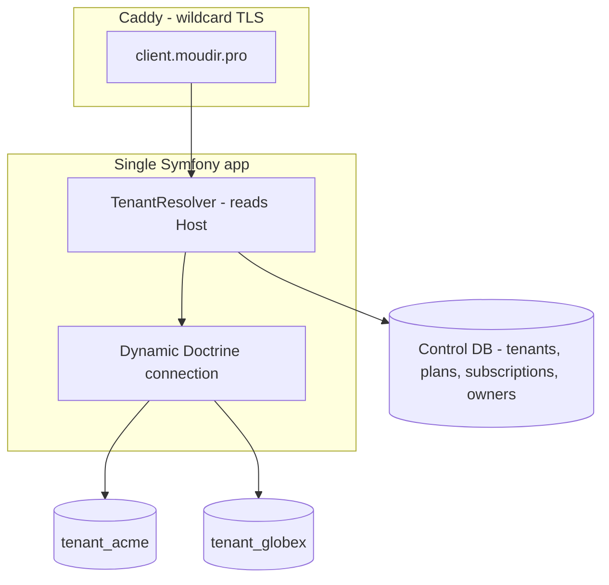

# SaaS architecture (Phase 4)

Goal: let customers self-serve sign up and get an isolated ERP instance at
`https://<tenant>.moudir.pro`, on a single app deployment, with subscription
billing suited to the Tunisian market.

> Prerequisite: the framework upgrade ([UPGRADE.md](UPGRADE.md)) must be done.
> Building multi-tenancy on the EOL framework would be throwaway work.

## Tenancy model: database-per-tenant

One shared application deployment talks to **N tenant databases** plus one
**control database**. This was chosen because the existing code is fully
single-tenant (`Societe` is hard-coded `find(1)`, no `tenant_id` anywhere), so
DB-per-tenant gives strong isolation with near-zero changes to the 35 entities.



### Two entity managers

- **`default` (control) EM** — maps the control-plane entities below. Connected
  via `DATABASE_URL`.
- **`tenant` EM** — maps the existing ERP entities. Its connection is rewritten
  per request to the resolved tenant's database (same DB server, different
  `dbname`).

Use Doctrine's `connections` + `entity_managers` config with a wrapper
connection class (or a `ConnectionFactory`) whose `dbname` is set from a
request-scoped `TenantContext`.

## Control-plane schema (control DB)

| Entity         | Key fields                                                            |
| -------------- | --------------------------------------------------------------------- |
| `Tenant`       | `id`, `subdomain` (unique), `dbName`, `status` (trial/active/suspended), `plan`, `createdAt` |
| `Owner`        | platform account that signs up; `email`, password, `tenant_id`        |
| `Plan`         | `code`, `name`, `priceMonthly`, limits (maxUsers, maxDocsPerMonth)     |
| `Subscription` | `tenant_id`, `plan`, `status`, `currentPeriodEnd`, `trialEndsAt`, `provider`, `providerRef` |
| `Payment`      | `subscription_id`, `amount`, `status`, `provider`, `providerRef`, `paidAt` |

## Request flow (TenantResolver)

1. A `kernel.request` listener (high priority) reads the `Host` header.
2. Apex / `www` / `app` -> control-plane routes (marketing, signup, operator
   back-office). No tenant connection.
3. `<sub>.moudir.pro` -> look up `Tenant` by `subdomain` in the control DB.
   - not found -> 404; `suspended` -> billing wall; `trial`/`active` -> proceed.
4. Set `TenantContext::setTenant($tenant)`; the tenant EM connection resolves
   `dbName` lazily on first use.

Per-tenant uploads are namespaced: `public/uploads/<tenant>/...`.

## Provisioning

A console command + a service triggered on successful signup:

```
php bin/console tenant:provision <subdomain> --plan=basic --owner-email=...
```

Steps: validate subdomain -> `CREATE DATABASE tenant_<slug>` -> run tenant
migrations on it -> seed `Societe` + an admin user -> start trial Subscription
-> send welcome email. Wrap in a transaction-like rollback (drop DB on failure).

## Schema rollouts across tenants

```
php bin/console tenants:migrate [--tenant=<sub>]
```

Iterates every `active`/`trial` tenant, points the tenant EM at each DB, and runs
`doctrine:migrations:migrate`. Wired into the deploy workflow after the control
DB migration.

## Billing (provider-agnostic, Tunisia-first)

Tunisia has no Stripe; common rails are **Konnect**, **Paymee**, **ClicToPay**,
and manual bank transfer (very common in B2B). Abstract behind one interface:

```php
interface PaymentProviderInterface {
    public function createCheckout(Subscription $s): CheckoutSession; // hosted page URL
    public function handleWebhook(Request $r): PaymentEvent;          // verify + parse
    public function supports(string $providerCode): bool;
}
```

- **Adapters**: `KonnectProvider`, `PaymeeProvider`, and `ManualTransferProvider`
  (operator marks paid). Start with one online provider + manual.
- **Webhook controller**: verify signature -> map to `Payment` + extend
  `Subscription.currentPeriodEnd` -> flip `Tenant.status` to `active`.
- **Plan enforcement**: a subscriber checks `Subscription` on each tenant request:
  - within period or trial -> allow;
  - lapsed past a grace window -> redirect to a billing/renew page (read-only or
    locked), set `Tenant.status = suspended`.
- **Limits**: enforce `Plan` limits (users, docs/month) with simple counters
  checked in the relevant create flows.

## Operator back-office

A `ROLE_PLATFORM_ADMIN`-guarded area (control DB) to list tenants, see
subscription status/usage, suspend/reactivate, and record manual payments.

## Rollout order

1. Two EMs + `TenantContext` + `TenantResolver` (no billing yet); provision one
   test tenant manually; verify isolation.
2. `tenant:provision` + `tenants:migrate` + signup flow.
3. Billing: manual provider first, then Konnect/Paymee + webhooks + enforcement.
4. Operator back-office.
